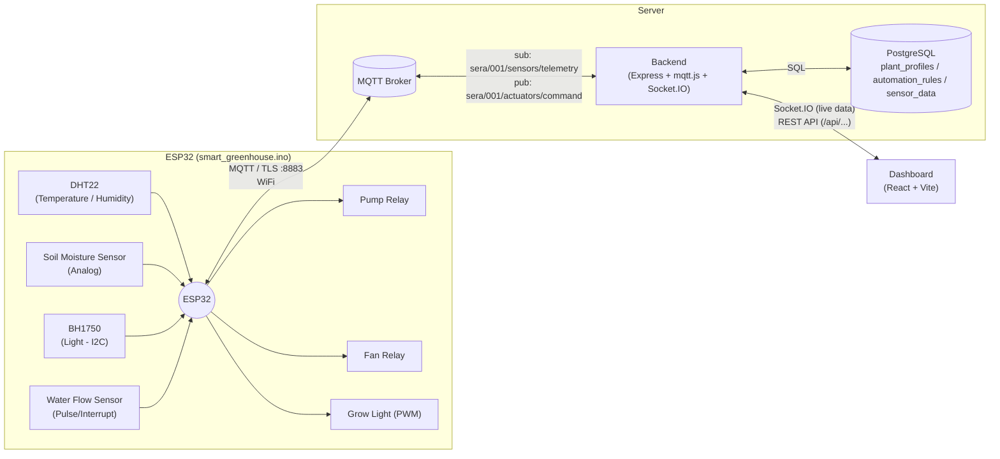

# Smart Greenhouse

An end-to-end IoT greenhouse automation system: an ESP32 collects sensor data and publishes it over MQTT, a Node.js backend stores it in PostgreSQL and automatically controls the pump/fan/grow light based on configurable plant profiles, and a React dashboard provides live monitoring plus manual control.

Device ID: `sera_001` (hardcoded in the code as the MQTT topic prefix `sera/001/...` and as `DEVICE_ID = 'sera_001'` — see "Things to Know").

## Table of Contents

- [Overall Architecture](#overall-architecture)
- [Connection Diagram](#connection-diagram)
- [Project Structure](#project-structure)
- [Tech Stack](#tech-stack)
- [Hardware and Pin Wiring](#hardware-and-pin-wiring)
- [MQTT Topic Schema](#mqtt-topic-schema)
- [Setup](#setup)
  - [0. Requirements](#0-requirements)
  - [1. Clone the repo](#1-clone-the-repo)
  - [2. Database setup](#2-database-setup)
  - [3. Backend setup](#3-backend-setup)
  - [4. Dashboard setup](#4-dashboard-setup)
  - [5. ESP32 firmware setup](#5-esp32-firmware-setup)
  - [6. Soil moisture sensor calibration](#6-soil-moisture-sensor-calibration)
- [Automation Logic](#automation-logic)
- [Backend API Endpoints](#backend-api-endpoints)
- [Database Schema](#database-schema)
- [Things to Know / Points of Caution](#things-to-know--points-of-caution)

## Overall Architecture

The system consists of three main parts:

1. **Firmware (`smart_greenhouse.ino`)** — runs on an ESP32. It reads a DHT22 (temperature/humidity), a soil moisture sensor, a BH1750 (light) and a water flow sensor; connects to WiFi and to an MQTT broker over TLS, publishing telemetry every 30 seconds. It also listens for commands from the broker and drives the pump, fan, and grow light via relays/PWM.
2. **Backend (`greenhouse-backend/`)** — a Node.js/Express/TypeScript API server. It connects to the MQTT broker, writes incoming telemetry to PostgreSQL, checks the configured automation rule (plant-profile thresholds) and publishes actuator commands when needed, and pushes data to the dashboard in real time via Socket.IO. It also exposes the REST API the dashboard consumes.
3. **Dashboard (`greenhouse-dashboard/`)** — a React + Vite + TypeScript web panel. It shows live sensor data over Socket.IO, renders history charts (Recharts), offers manual actuator control, and lets you manage plant profiles/automation settings.

There is **no direct connection** between the backend and the firmware — both only talk through the MQTT broker. A working MQTT broker (TLS-enabled, with username/password auth) is therefore required.

## Connection Diagram



**Data flow summary:**
1. Sensors → ESP32 → JSON → MQTT (`sera/001/sensors/telemetry`)
2. The backend listens for telemetry → writes it to the `sensor_data` table → checks the automation rules → publishes a command to `sera/001/actuators/command` if needed → emits it to the dashboard via Socket.IO
3. The dashboard receives live data over Socket.IO; fetches history and profiles via REST; and sends manual control or profile/automation changes to the backend via REST
4. Manual commands issued from the backend also reach the ESP32 through the same MQTT topic (`sera/001/actuators/command`)

## Project Structure

```
smart-greenhouse/
├── smart_greenhouse.ino       # ESP32 firmware
├── secrets.h.example          # WiFi/MQTT credentials template (copy to secrets.h)
├── makefile                   # arduino-cli compile/upload/monitor commands
├── init.sql                   # PostgreSQL schema + seed data
├── .gitignore
│
├── greenhouse-backend/        # Node.js + Express + TypeScript API
│   ├── package.json
│   ├── tsconfig.json
│   └── src/
│       ├── index.ts           # Express + Socket.IO entry point
│       ├── db.ts              # PostgreSQL connection pool
│       ├── mqtt.ts            # MQTT connection, telemetry handling
│       ├── automation.ts      # Threshold-based automation logic
│       └── routes/
│           ├── sensors.ts     # /api/sensors/*
│           ├── actuators.ts   # /api/actuators/*
│           └── profiles.ts    # /api/profiles/*
│
└── greenhouse-dashboard/      # React + Vite + TypeScript panel
    ├── package.json
    ├── vite.config.ts
    └── src/
        ├── main.tsx
        ├── App.tsx            # All UI logic (sensor cards, chart, actuator control, profiles)
        └── index.css
```

## Tech Stack

| Layer | Technologies |
|---|---|
| Firmware | ESP32 (Arduino framework), `WiFi.h`, `WiFiClientSecure`, `PubSubClient` (MQTT), `ArduinoJson`, `DHT sensor library` (DHT22), `BH1750` |
| Backend | Node.js, TypeScript, Express 5, `mqtt` (mqtt.js), `socket.io`, `pg` (PostgreSQL client), `dotenv`, `cors` |
| Dashboard | React 19, Vite, TypeScript, `recharts`, `socket.io-client`, `axios` |
| Database | PostgreSQL |
| Messaging | MQTT (TLS, port 8883) |

## Hardware and Pin Wiring

Pin numbers are defined in `smart_greenhouse.ino` (ESP32 GPIO numbers):

| Component | Pin | Notes |
|---|---|---|
| DHT22 (temperature/humidity) | GPIO 4 | Digital data line |
| Soil moisture sensor | GPIO 34 | Analog input |
| Water flow sensor | GPIO 18 | Interrupt (pulse counting), `INPUT_PULLUP` |
| Pump relay | GPIO 26 | Digital output |
| Fan relay | GPIO 14 | Digital output |
| Grow light | GPIO 25 | PWM output (`analogWrite`) |
| BH1750 (light) | I2C (default SDA/SCL pins via `Wire.begin()`) | Connects over I2C |

**On relay wiring:** the pump and fan relays are wired as NC (normally closed), so the "running" state corresponds to a HIGH signal (verified by physical testing — noted in the code). At startup the pump starts off (LOW) while the fan starts on (HIGH). If your relay modules are NC/NO differently, check and adapt this logic in the `callback()` function and the startup states in `setup()` in `smart_greenhouse.ino`.

**Water flow sensor calibration:** the code computes L/min as `pulseCount / (7.5 * (SEND_INTERVAL/1000))`; the `7.5` coefficient is specific to the sensor used (a typical value for YF-S201-style sensors) — if you use a different sensor, you'll need to change this coefficient.

## MQTT Topic Schema

| Topic | Direction | Payload (JSON) | Description |
|---|---|---|---|
| `sera/001/sensors/telemetry` | ESP32 → Backend | `{device_id, temperature, humidity, soil, light_lux, flow_lpm}` | Published by the ESP32 every 30 seconds (`SEND_INTERVAL`) |
| `sera/001/actuators/command` | Backend → ESP32 | `{actuator: "pump"\|"fan"\|"light", state: boolean}` | Triggered both by the automation logic (`automation.ts`) and by manual panel commands (`POST /api/actuators/command`) |

> Note: topic names are hardcoded as `sera/001` in both the firmware and the backend; `DEVICE_ID` (secrets.h) is only carried inside the telemetry payload and doesn't determine the topic name. If you want to support multiple devices, you'll need to parameterize the topic names too (see "Things to Know").

## Setup

### 0. Requirements

**Software:**
- Node.js 18+ and npm
- PostgreSQL (local install or a cloud service like Supabase / Neon / Railway)
- A TLS-enabled MQTT broker with username/password auth (e.g. HiveMQ Cloud, EMQX Cloud, or your own Mosquitto server — port 8883 open with TLS enabled)
- `arduino-cli` (to compile/upload the firmware) or the Arduino IDE
- Git

**Hardware:**
- ESP32 development board
- DHT22 temperature/humidity sensor
- BH1750 light sensor (I2C)
- Soil moisture sensor (analog output)
- Water flow sensor (pulse output, e.g. YF-S201 type)
- 3× relay module (for pump, fan, grow light) or a PWM-capable driver
- USB-to-serial cable

### 1. Clone the repo

```bash
git clone https://github.com/bobosii/smart-greenhouse.git
cd smart-greenhouse
```

### 2. Database setup

Create an empty PostgreSQL database and run `init.sql` against it:

```bash
createdb sera_db   # if the database doesn't exist yet
psql -U <username> -d sera_db -f init.sql
```

This script creates the following tables and inserts the seed data:
- `plant_profiles` — per-plant temperature/humidity/soil/light threshold ranges
- `automation_rules` — which profile is active for which device, and whether automation is on/off
- `sensor_data` — every incoming telemetry record

By default it inserts a "General Greenhouse Plant" profile and an (inactive) automation record for the `sera_001` device.

### 3. Backend setup

```bash
cd greenhouse-backend
npm install
```

There is no ready-made `.env.example` in the repo; create a `.env` file yourself in `greenhouse-backend/` with the following variables (derived from `src/db.ts` and `src/mqtt.ts`):

```env
PORT=3000

# MQTT
MQTT_HOST=<mqtt-broker-address>
MQTT_PORT=8883
MQTT_USER=<mqtt-username>
MQTT_PASS=<mqtt-password>

# PostgreSQL
DB_HOST=<postgres-host>
DB_PORT=5432
DB_NAME=sera_db
DB_USER=<postgres-username>
DB_PASS=<postgres-password>
```

Run it:

```bash
npm run dev
```

The server comes up on `http://localhost:3000` and attempts to connect to the MQTT broker. You should see an "MQTT baglandi" ("MQTT connected") message in the console.

### 4. Dashboard setup

```bash
cd greenhouse-dashboard
npm install
```

Optionally create a `.env` file to point at your backend (defaults to `http://localhost:3000` if not set):

```env
VITE_API_URL=http://localhost:3000
```

Start the dev server:

```bash
npm run dev
```

Open the dashboard at the address Vite prints (typically `http://localhost:5173`).

### 5. ESP32 firmware setup

1. Copy the credentials template and fill in your own values:

   ```bash
   cd smart-greenhouse   # repo root
   cp secrets.h.example secrets.h
   ```

   Edit `secrets.h`:

   ```cpp
   #define WIFI_SSID "your-wifi-name"
   #define WIFI_PASSWORD "your-wifi-password"

   #define MQTT_HOST "your-mqtt-broker-address"
   #define MQTT_PORT 8883
   #define MQTT_USER "your-mqtt-username"
   #define MQTT_PASS "your-mqtt-password"
   #define DEVICE_ID "sera_001"
   ```

   `secrets.h` is listed in `.gitignore`, so it won't be committed.

2. Install the ESP32 core and required libraries with `arduino-cli` (if not already installed):

   ```bash
   arduino-cli core update-index
   arduino-cli core install esp32:esp32

   arduino-cli lib install "DHT sensor library"
   arduino-cli lib install "BH1750"
   arduino-cli lib install "PubSubClient"
   arduino-cli lib install "ArduinoJson"
   ```

3. Update the `PORT` variable in `makefile` to match your serial port (the default `/dev/cu.usbserial-0001` is macOS-specific; on Linux it's usually `/dev/ttyUSB0`, on Windows something like `COM3`):

   ```makefile
   PORT = /dev/cu.usbserial-0001
   ```

4. Compile and upload:

   ```bash
   make flash      # compile + upload
   make monitor    # watch serial output (115200 baud)
   ```

   Use `make compile` to only compile, or `make upload` to only upload.

### 6. Soil moisture sensor calibration

The code maps the raw analog reading (`analogRead(SOIL_PIN)`) into a `0–100` range using the constants `SOIL_DRY = 1984` and `SOIL_WET = 945`. These values depend on your specific sensor and soil:

1. Read the raw value with the sensor in completely dry air and set it as `SOIL_DRY`.
2. Read the raw value with the sensor submerged in water and set it as `SOIL_WET`.

Update both constants in `smart_greenhouse.ino`.

## Automation Logic

`greenhouse-backend/src/automation.ts` runs on every incoming telemetry message:

1. It checks whether an active (`active = true`) `automation_rules` record exists for the given `device_id`; if not, it does nothing (manual control applies).
2. If one exists, it compares the current sensor reading against the linked `plant_profiles` thresholds:
   - **Soil moisture** below the minimum → pump **ON**; above the maximum → pump **OFF**
   - **Temperature or humidity** above the maximum → fan **ON**; dropping a margin below the maximum → fan **OFF**
   - **Light** below the minimum → grow light **ON**; above the maximum → grow light **OFF**
3. A command is only logged when the state actually changes (to avoid noisy logs), but it is still published over MQTT on every check.

From the "Plant Profiles" tab in the dashboard you can choose which profile is active, turn automation on/off, and create new profiles (threshold sets).

## Backend API Endpoints

| Method | Path | Description |
|---|---|---|
| GET | `/api/sensors/latest` | Returns the most recent sensor reading |
| GET | `/api/sensors/history?hours=N` | Returns history for the last N hours (default 24) |
| POST | `/api/actuators/command` | `{ actuator, state }` — manual actuator command; publishes to MQTT |
| GET | `/api/profiles` | Lists all plant profiles |
| POST | `/api/profiles` | Creates a new plant profile |
| GET | `/api/profiles/automation/:device_id` | Returns the device's current automation state/profile |
| POST | `/api/profiles/automation` | `{ device_id, profile_id, active }` — sets/updates automation |

The backend also emits a `sensor_data` event over Socket.IO to all connected dashboard clients whenever new telemetry arrives.

## Database Schema

`init.sql` creates the following tables:

- **`plant_profiles`**: `id, name, temp_min, temp_max, humidity_min, humidity_max, soil_min, soil_max, light_min, light_max, created_at`
- **`automation_rules`**: `id, device_id (unique), profile_id (FK → plant_profiles), active, updated_at`
- **`sensor_data`**: `id, device_id, temperature, humidity, soil, light_lux, flow_lpm, recorded_at` (index: `device_id + recorded_at`)

## Things to Know / Points of Caution

- **MQTT TLS certificate verification is disabled**: the ESP32 uses `espClient.setInsecure()` and the backend uses `rejectUnauthorized: false`. This is convenient for development but leaves the connection open to man-in-the-middle attacks; enabling proper certificate verification is recommended for production.
- **Single-device assumption**: the MQTT topics (`sera/001/...`) and the dashboard's `DEVICE_ID` are hardcoded. If you want to support multiple greenhouses/devices, you'll need to parameterize the topic names and add device selection to the dashboard.
- **Grow light percentage isn't fully propagated**: the dashboard's light slider holds a percentage value, but it's only sent to the backend and the ESP32 as on/off (`state: boolean`); the ESP32 side also only sets the light PWM to 0 or 255. True graduated brightness control would require both the dashboard's payload and the `callback()` function to carry an actual percentage/PWM value.
- **No tests/CI**: the `test` script in the backend's `package.json` is a placeholder (`no test specified`); there is no automated testing or CI pipeline.
- **No `.env` template**: while `secrets.h.example` exists for the firmware, there's no `.env.example` in the repo for the backend — use the variable list above as your reference.
